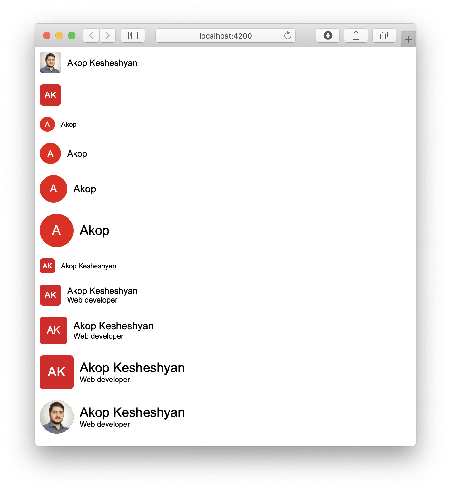

# ng-person

A universal avatar component for Angular 2+ applications that generates truly unique colored letter avatar based on provided name. It also supports user photo, name with subtitle and different styles.



## Installation

Install ng-person component using NPM:

```
$ npm install ng-person --save
```

## Usage

1. Once you have installed ng-person, you can import it into your AppModule:

```javascript
import { BrowserModule } from '@angular/platform-browser';
import { NgModule } from '@angular/core';

import { AppComponent } from './app.component';
import { NgPersonModule } from 'ng-person';

@NgModule({
  declarations: [
    AppComponent
  ],
  imports: [
    BrowserModule,
    // Specify NgPersonModule as an import 
    NgPersonModule
  ],
  providers: [],
  bootstrap: [AppComponent]
})
export class AppModule { }
```

1. Call component from your Angular application:

```html
<ng-person name="Akop Kesheshyan"></ng-person>
```

## Examples

```html
<ng-person name="Akop Kesheshyan" title="Software Developer"></ng-person>

<ng-person picture="https://example.com/pic.jpg" showName="false"></ng-person>

<ng-person name="Akop Kesheshyan" size="large" round="true"></ng-person>
```

## Options

Attribute | Type    | Description
--------- | ------- | ------------------------------------------------------------------------------
picture   | string  | Absolute path to a picture image.
name      | string  | Specifies a name to be shown on the right of a user picture.
title     | string  | Specifies a title to be shown under the name.
showName  | boolean | Whether to show a user name or not.
round     | boolean | Round corners of the picture box.
size      | string  | Size of the component. Possible values: `small`, `medium (default)`, `large`, `giant`.

## License

MIT &copy; [Akop Kesheshyan](mailto:hello@akop.dev)